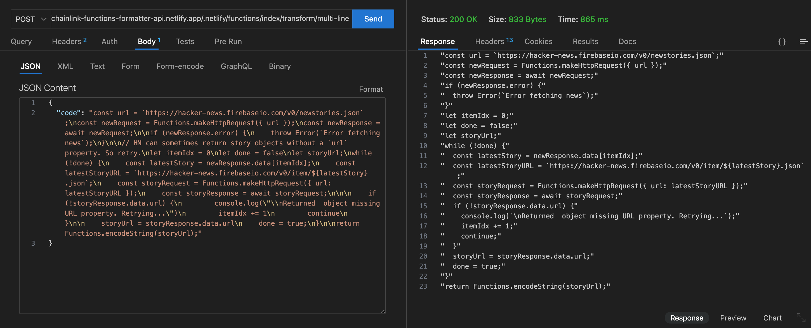
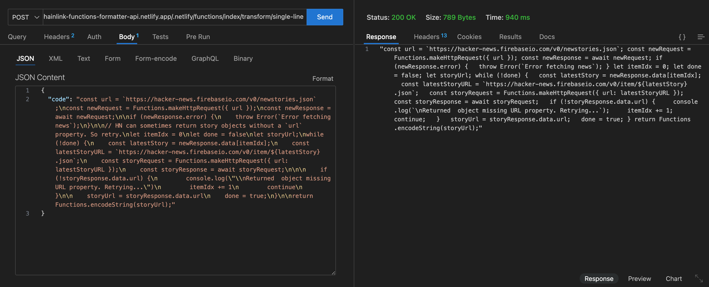
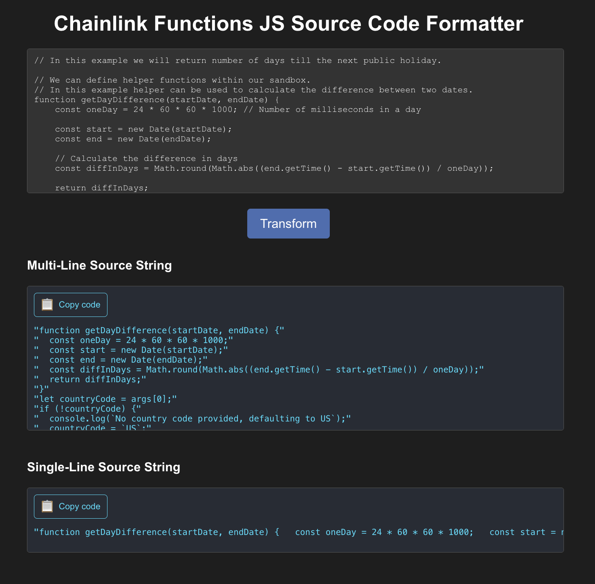

# Chainlink Functions JS Source Code Formatter API

An API for transforming JS source code into multi-line or single-line formats as required by Chainlink Functions source strings.

Basically, the API provides functionality to transform code by:

- Replacing double quotes and single quotes with backticks
- Adding semicolons
- Removing single-line and multi-line comments

Thereby, generating **multi-line source string** with quotes on each line and **single-line source string** enclosed in double quotes.

The API is deployed on Netflify at `https://chainlink-functions-formatter-api.netlify.app/.netlify/functions/index`.

There are two endpoints:

1. `/transform/multi-line`




2. `/transform/single-line`




## Chainlink Functions JS Source Code Formatter UI

The UI interacting with this API is available at https://chainlink-functions-js-formatter.netlify.app.




## Running Locally

If you want to run this API locally, then you can follow these steps:

1. Clone the Repository:

```bash
git clone https://github.com/SyedAsadKazmi/Chainlink-Functions-JS-Source-Code-Formatter-API
cd Chainlink-Functions-JS-Source-Code-Formatter-API
```

2. Install Dependencies: 

```bash
npm install
```

3. Start the Server:

```bash
npm start
```

The server will start and be available at http://localhost:8000.
